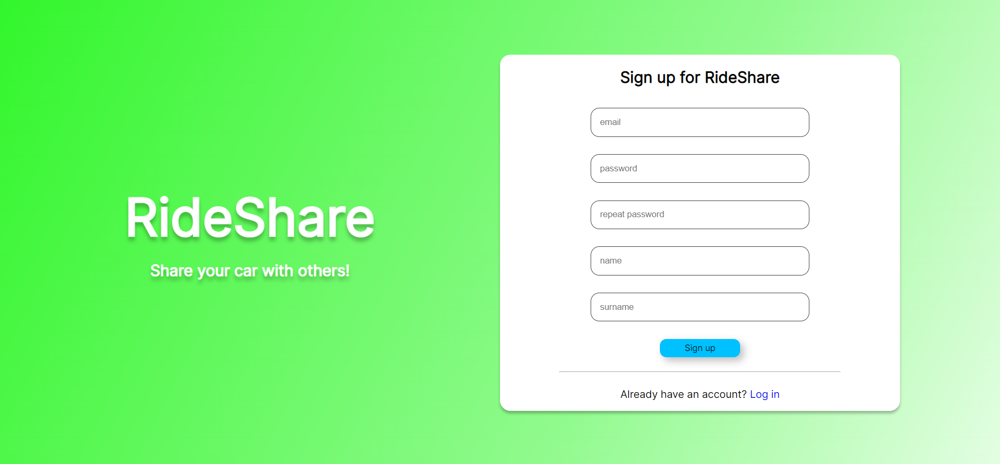
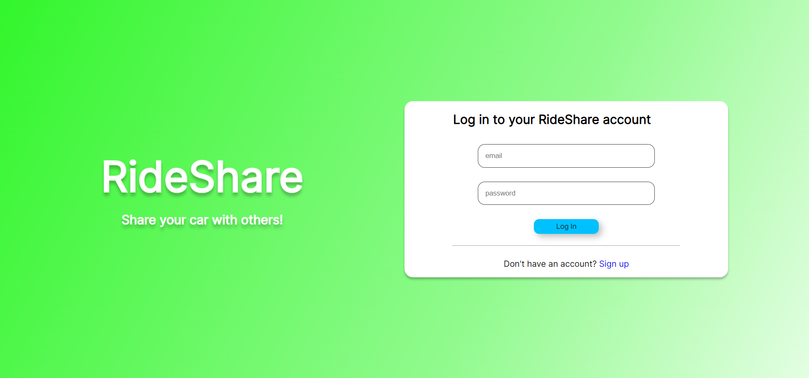
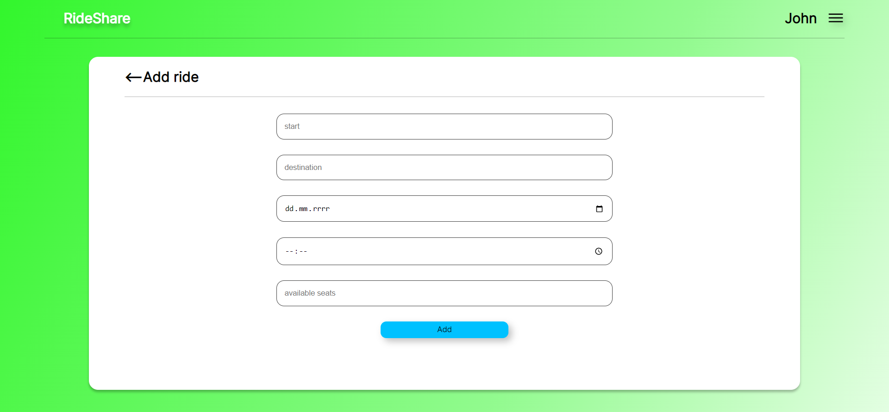
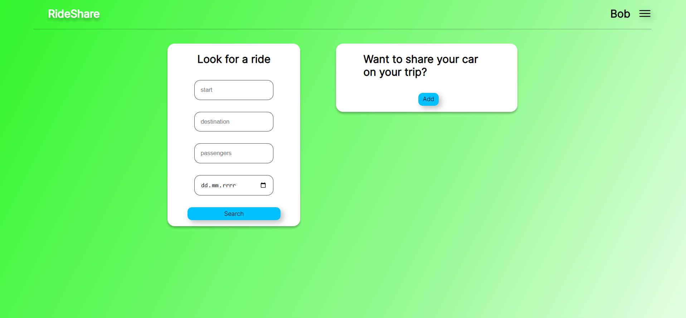
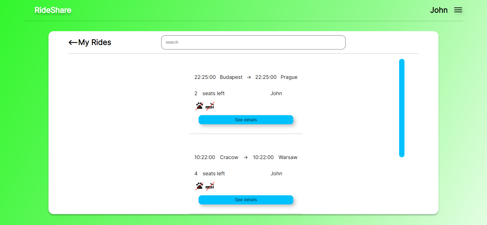
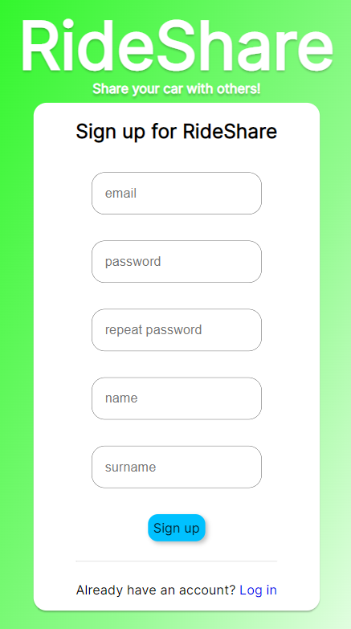
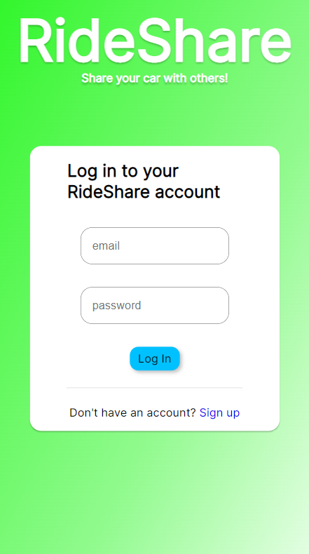
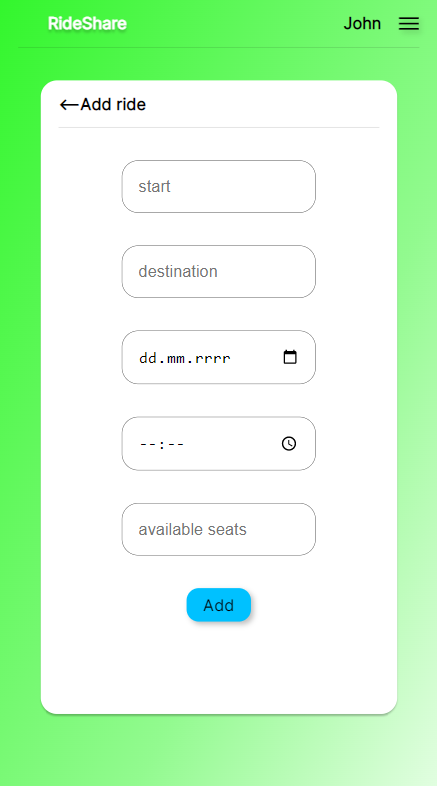
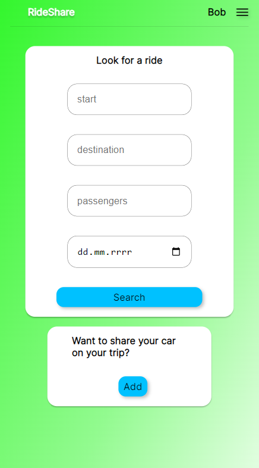
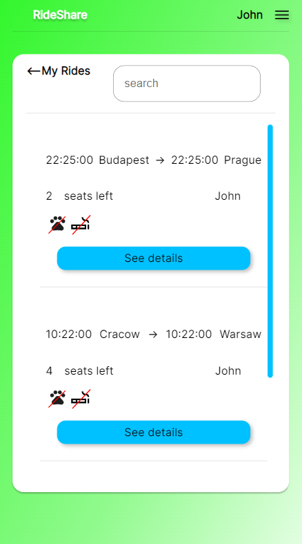

# RideShare

Are you tired from unsuccessfully looking for hitchhike? This web application is for you.
On RideShare you can look for rides or create your own and share your car on your trip to others!

## Features:
  - Adding your ride for other people to join
  - Joining rides from other users
  - Searching your added or joined rides
  - Browsing all rides that meet your requirement (starting location, destination, date)
  - Removing harmful users as administrator
  - Minimalistic design with easily accessible buttons

## Technologies used:
 - HTML
 - CSS
 - JS
 - PHP
 - PostgreSQL
 - Docker

## Installation guide:
1. Requirements:
   - Docker installed on your machine
2. Clone this repository:
    ```
    git clone https://github.com/kjzieba/Hitchhiking-App.git
    ```
3. Create .env and env.php files in root directory with variables used for connecting to database:
   - .env 
   ```
    DB_NAME='your_db_name'
    DB_USER='your_db_user'
    DB_PASSWORD='your_db_password'
    DB_HOST='your_db_host'
    ```
   - env.php
    ```
    <?php
    
    const DB_NAME='your_db_name';
    const DB_USER='your_db_user';
    const DB_PASSWORD='your_db_password';
    const DB_HOST='your_db_host';
    ```
4. Run those commands in terminal:
    ```
    docker compose build
    ```
    To create database tables type one of those commands:

   - On windows:
       ```
       type database.sql | docker exec -i {your_db_container} psql -U {your_db_user} -d {your_db_name}
       ```
   - On Linux/MacOS:
       ```
       cat database.sql | docker exec -i {your_db_container} psql -U {your_db_user} -d {your_db_name}
       ```

    ```
    docker compose up
    ```
5. Application is ready to be accessed at http://localhost:8080.

## Screenshots
- Desktop
  
  
  
  
  

- Mobile
  
  
  
  
  